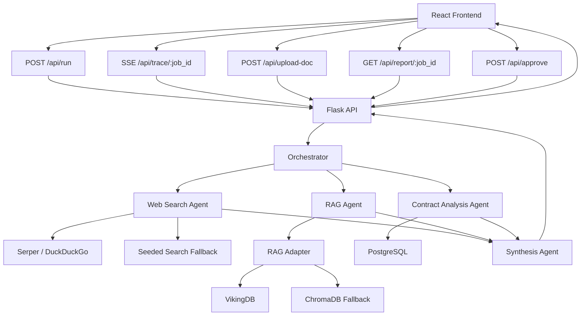
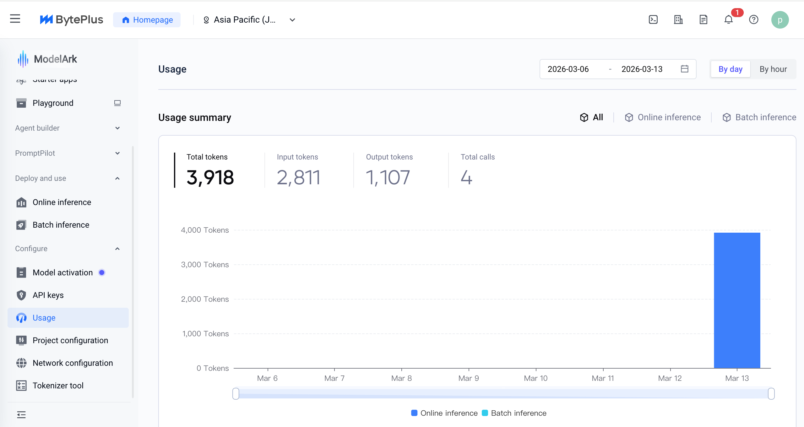

# SupplyMind

## 1. Intro
Agentic procurement intelligence

SupplyMind is a focused enterprise AI demo: a user describes a procurement objective, uploads optional market documents, and a multi-agent system produces a recommendation with traceable reasoning, optimization variants, and a human approval step.

This project is not a generic chat wrapper. It demonstrates:

- agentic planning rather than single-shot prompting
- parallel tool use across web search, document RAG, and contract analysis
- grounded decision support using internal contracts plus external evidence
- visible reasoning through a live execution trace
- human-in-the-loop approval before action

The core idea is simple: procurement teams do not need another chatbot, they need a system that can research, compare, explain, and still leave the final decision to a person.

---

## 2. The Problem

Enterprise procurement decisions usually require combining:

- current supplier contracts
- changing market prices
- supplier or analyst documents
- delivery and risk trade-offs

That work is often fragmented across spreadsheets, emails, PDFs, and manual benchmarking.

SupplyMind turns that process into one guided workflow.

---

## 3. The Product

The user journey is:

1. Enter a procurement goal in plain English.
2. Optionally upload a PDF such as a supplier catalogue or market report.
3. Watch the orchestrator decompose the task and launch specialist agents in parallel.
4. Review three recommendation flavours:
   - `Cheapest`
   - `Lowest Risk`
   - `Fastest`
5. Inspect flagged contract corrections.
6. Approve the final strategy.
7. Export an executive-ready report.

This is presented through a polished UI designed to function as both:

- a working system
- a clear project presentation for technical and product-minded judges

---

## 4. Demo Flow

Recommended demo prompt:

`Find the cheapest EU steel supplier for Q3 delivery with at least 500 metric tons capacity`

Optional demo document:

[docs/demo_steel_report.pdf]

Best demo sequence:

1. Open the dashboard.
2. Show the company/material overview.
3. Launch the optimization studio.
4. Run the example goal.
5. Point out the live agent trace and parallelism.
6. Review the three variants and correction flags.
7. Open the final report and export it.

---

## 5. Why This Is A Strong BytePlus-Style Demo

The project maps well to enterprise AI infrastructure evaluation:

- **ModelArk fit**: structured reasoning and report synthesis
- **VikingDB fit**: document retrieval over uploaded procurement PDFs
- **Agent framework thinking**: orchestration, specialist agents, synthesis
- **Enterprise reality**: auditability, data correction, and HITL approval

It is deliberately scoped to be convincing in a demo, not bloated with production-only concerns.

---

## 6. System Architecture



### Architecture in one sentence

The orchestrator plans the work, three specialist agents execute in parallel, and a synthesis agent turns the results into an executive report.

---

## 7. What Is Real In The Current Build

Implemented and working:

- Flask API routes
- background pipeline execution
- SSE-based live trace streaming
- PostgreSQL-backed contract and product data
- PDF upload and chunking
- ChromaDB retrieval flow
- deterministic contract optimization and correction detection
- full frontend flow from input to exportable report

Implemented with fallback support:

- ModelArk reasoning
- live web search
- VikingDB storage

This matters because the demo remains runnable even when external services are unreliable.

---

## 8. Multi-Agent Workflow

### Orchestrator

Takes a plain-language goal and converts it into:

- research questions
- optimization strategies
- context such as product focus and urgency

File:

[backend/agents/orchestrator.py]

### Web Search Agent

Finds market information and supplier signals using:

- Serper API if available
- DuckDuckGo fallback
- seeded market data fallback

Files:

[backend/agents/web_search.py]
[backend/skills/search_skill.py]

### RAG Agent

Retrieves relevant passages from uploaded PDFs and returns:

- evidence-backed answer
- citations
- confidence and gaps

Files:

[backend/agents/rag_agent.py] 
[backend/skills/rag_skill.py]

### Contract Analysis Agent

Benchmarks owned contracts against market offers and generates:

- data corrections
- three optimization flavours
- analyst notes

File:

[backend/agents/contract_agent.py]

### Synthesis Agent

Combines all specialist outputs into a procurement report designed for executive review.

File:

[backend/agents/synthesis.py]

---

## 9. Prompt Design

The prompt set is documented in [docs/prompts.md]. The key design principle is structured, role-specific prompts rather than one large generic prompt.

### Prompt roles

- **Orchestrator prompt**: decomposes goals into a plan
- **Web search prompt**: extracts structured market intelligence from search results
- **RAG prompt**: answers only from retrieved document chunks
- **Synthesis prompt**: assembles the final executive report

### Why this design is strong

- each agent has a clear responsibility
- outputs are schema-shaped and easier to validate
- citation and null-handling reduce hallucination risk
- low temperature is used for consistent structured output

---

## 10. BytePlus Integration

### ModelArk

Configured in:

[backend/config.py]

Used for:

- goal decomposition
- market extraction
- document synthesis
- final report generation

Current status:

- integration code is implemented
- the project includes a mock-safe fallback path




### VikingDB

Integrated behind an adapter in:

[backend/skills/rag_skill.py]

Current status:

- VikingDB support is implemented
- ChromaDB is the active fallback in demo mode
- switching back to VikingDB only requires credentials plus `USE_MOCK_VIKINGDB=false`

### OpenClaw

No public OpenClaw package is used here. Instead, the project implements the orchestration pattern directly:

- planning
- parallel specialist execution
- synthesis

This is the honest engineering trade-off: preserve the architecture even when the framework surface is not practically usable.

---

## 11. Example Trace

Representative live event:

```json
{
  "event": "SEARCHING",
  "agent": "web_search",
  "timestamp": "2026-03-13T12:34:56.000000+00:00",
  "message": "[1/2] Searching: EU industrial steel spot price 2025"
}
```

What this proves in a demo:

- the system exposes intermediate work
- agents are not hidden behind a spinner
- parallelism can be shown with timestamps

---

## 12. User Experience

The frontend was intentionally redesigned to read like a product showcase:

- dashboard introduces the company context
- optimization studio explains the system while the user interacts with it
- live run page visualizes the pipeline as a modern execution timeline
- HITL screen makes governance explicit
- final report page feels presentation-ready rather than debug-oriented

Key frontend files:

[frontend/src/pages/DashboardPage.tsx]
[frontend/src/pages/HomePage.tsx]
[frontend/src/pages/AgentRunPage.tsx] 
[frontend/src/pages/HITLPage.tsx]
[frontend/src/pages/ReportPage.tsx]

---

## 13. Engineering Trade-Offs

These decisions were intentional:

- in-memory job state instead of persistent orchestration storage
- deterministic optimization for reliability and explainability
- fallback-first design for demos under infrastructure uncertainty
- no auth, billing, multi-tenancy, or ERP integrations

This keeps the project sharp, demoable, and focused on agentic reasoning rather than platform overhead.

---

## 14. What I Would Build Next

- persistent job history and replayable traces
- editable optimization constraints beyond the three built-in flavours
- supplier scorecards and scenario comparison
- ERP ingestion instead of seeded contract data
- approval ledger and audit export
- stronger fulfillment logic for volume-aware contract selection
- production-grade deployment, auth, and tenancy

---

## 15. Local Run

### Backend

```bash
cd backend
python3 -m venv venv
source venv/bin/activate
pip install -r requirements.txt
python app.py
```

### Database

```bash
docker-compose up -d
```

### Frontend

```bash
cd frontend
npm install
npm run dev
```

Default local URLs:

- frontend: `http://localhost:5173`
- backend: `http://localhost:5000`
- postgres: `localhost:5433`

Environment variables are listed in [.env.example].

---

## 16. Key Files

- API and orchestration: [backend/app.py]
- configuration: [backend/config.py]
- database schema: [backend/db/schema.sql]
- seed data: [backend/db/seed.sql]
- prompts: [docs/prompts.md]
- build plan: [docs/build-plan.md]

---

Built with love using Claude Code 
